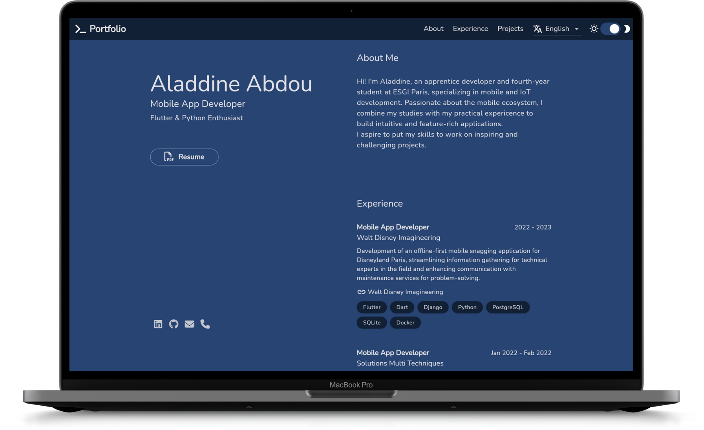
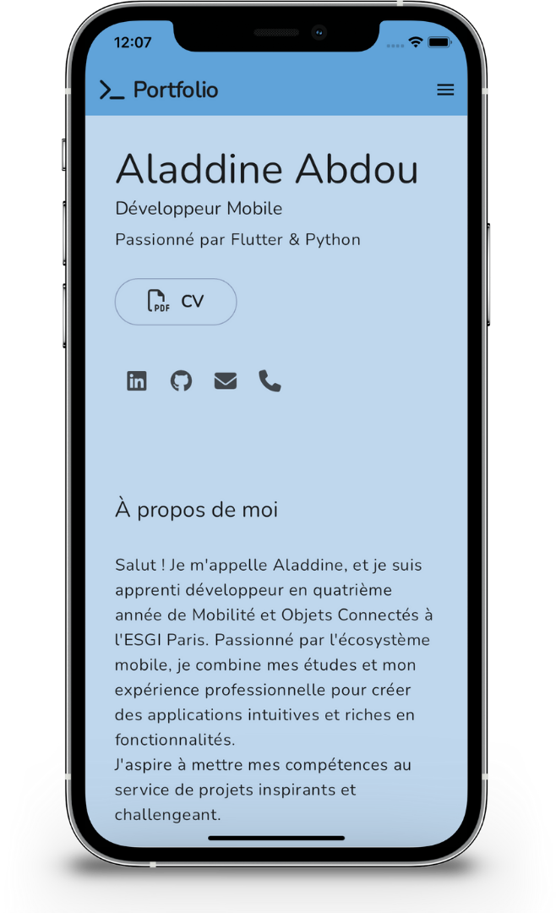
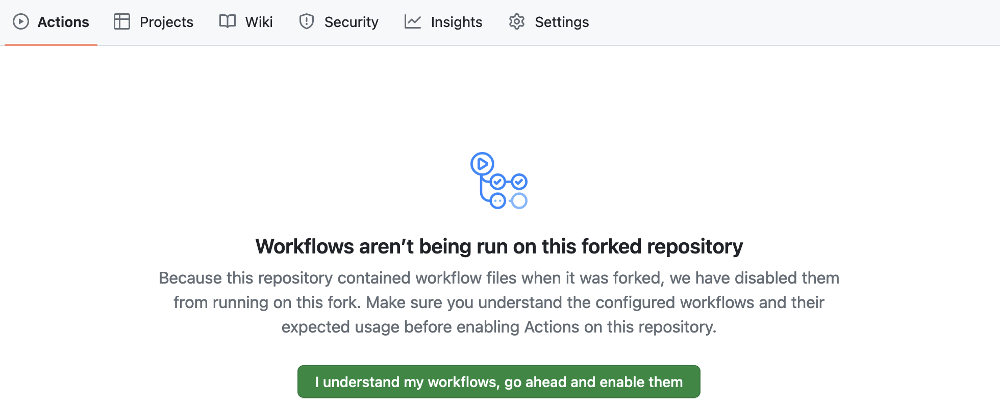
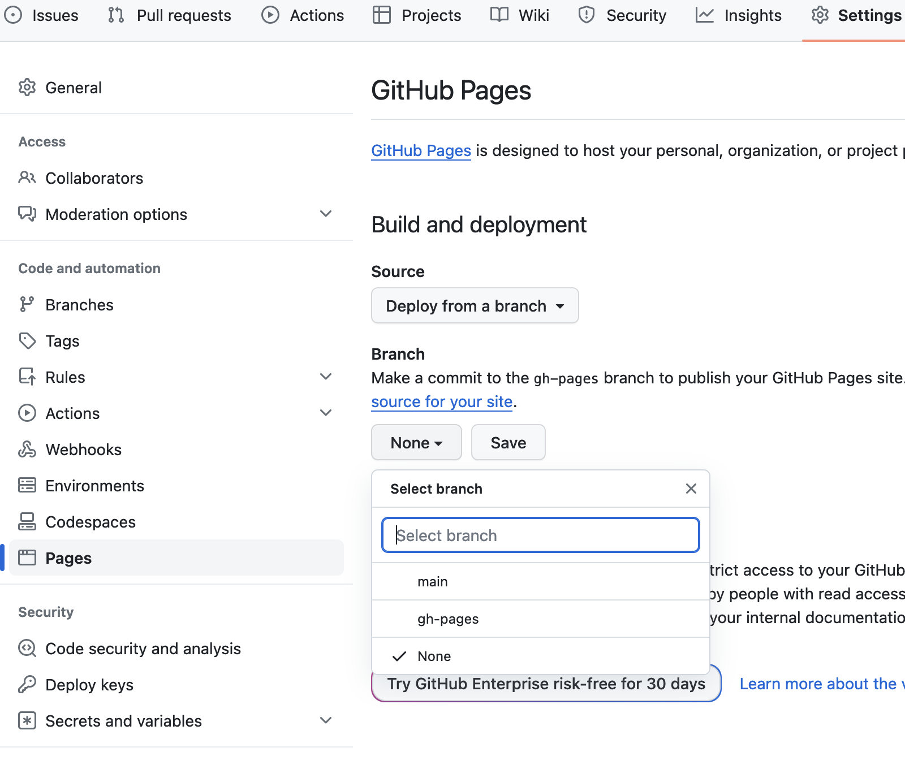
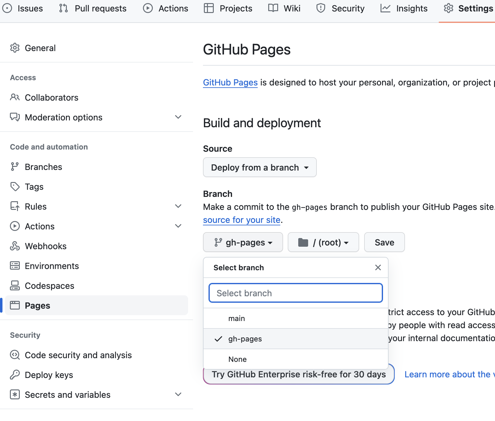

# Portfolio 💙 [](https://github.com/AladdineDev/portfolio/blob/master/LICENSE.md) [](https://github.com/AladdineDev/portfolio/stargazers) [](https://github.com/AladdineDev/portfolio/forks?include=active&page=1&period=&sort_by=stargazer_counts)

Flutter Portfolio – by [@AladdineDev](https://github.com/AladdineDev)

[](https://flutter.dev/)
[](https://dart.dev/)

## [Live Preview](https://aladdine.dev) 👀




## Features ✨

💙 Responsive and adaptive design inspired by [Brittany Chiang](https://brittanychiang.com)\
💙 [Riverpod Architecture](https://codewithandrea.com/articles/flutter-app-architecture-riverpod-introduction/) by [Andrea Bizzotto](https://github.com/bizz84)\
💙 Feature-first structure\
💙 Multiple languages\
💙 Multiple themes\
💙 Multi-platform (Android, iOS, macOS, Windows, Linux, Web)

## Getting started 🚀

If you haven't already, install [Flutter](https://docs.flutter.dev/get-started/install)

[Fork](https://github.com/AladdineDev/portfolio/fork) and [clone](https://docs.github.com/en/get-started/quickstart/fork-a-repo#cloning-your-forked-repository) this repository

| Enable your workflows to allow deployment |
| -----------------------------------------------|
| |

From here, you're all set to [deploy](#deploy) your portfolio online. To build it locally and make customizations, follow the instructions below.

**1. Install dependencies:**

```bash
$ flutter pub get
```

**2. Run the code generator:**

```bash
$ dart run build_runner build -d
```

> For additional information, refer to the [build_runner](https://pub.dev/packages/build_runner) documentation

<a id="generate-localization-files" style="text-decoration:none">**3. Generate localization files:**</a>

```bash
$ dart run easy_localization:generate -S assets/translations -f json -O lib/src/localization/generated -o locale_json.g.dart
$ dart run easy_localization:generate -S assets/translations -f keys -O lib/src/localization/generated -o locale_keys.g.dart
```

### Deploy

<a id="deploy" style="text-decoration:none">**Automatically deploy your portfolio to GitHub Pages with GitHub Actions:**</a>

```bash
$ git push
```

Your deployment will be available in few minutes at this URL: https://<YOUR_USERNAME>.github.io/portfolio
Whenever you want to redeploy your portfolio, simply push your changes as you did.

Additionally for your first deployment, you'll need to select the proper GitHub Pages branch.

| Go to the Settings tab and then click Pages. The branch is currently set to _None_. | Set the branch to _gh-pages_ and save to redeploy.  |
| ----------------------------------------------------------------------------------- | --------------------------------------------------- |
|                                      |  |

## Personalization 🛠️

### Content 🖋

**1. Portfolio Content:**\
Customize the portfolio content by modifying or adding JSON translation files within the [`assets/translations`](assets/translations) folder. Don't forget to [re-generate your localization files](#generate-localization-files) when working locally. For an understanding of how JSON translation files are structured, refer to the [translation template](docs/translation-template.md)

If you add or remove a JSON translation file, remember to update the `languages` key in your other translation files. Also, update the supported locales in the [`lib/src/localization/app_localizations.dart`](lib/src/localization/app_localizations.dart)

> For additional information, refer to the [easy_localization](https://pub.dev/packages/easy_localization) documentation

**2. Your description:**\
Update your description content in the `build/web/index.html`:

```html
<meta name="description" content="..." />
```

### Theme 🎨

**1. Launcher Icon and Splash Screen:**\
Update your launcher icon and your splash screen in the [`pubspec.yaml`](pubspec.yaml)

Then, run:

```bash
$ dart run flutter_launcher_icons
$ dart run flutter_native_splash:create
```

> For additional information, refer to the [flutter_launcher_icons](https://pub.dev/packages/flutter_launcher_icons) and [flutter_native_splash](https://pub.dev/packages/flutter_native_splash) documentations

## License 📄

This project is licensed under the MIT License - see the [LICENSE](https://github.com/AladdineDev/portfolio/blob/main/LICENSE.md) file for details
