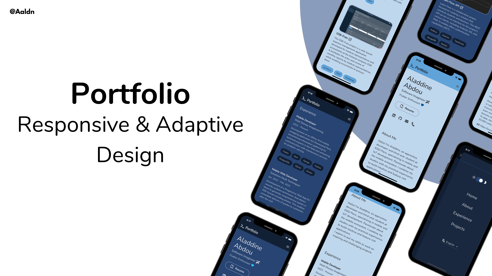

# Portfolio 💙 [](https://github.com/Aaldn/portfolio/blob/master/LICENSE.md)  

Flutter Portfolio – by [@Aaldn](https://github.com/Aaldn)

[](https://flutter.dev/)
[](https://dart.dev/)
[](https://firebase.google.com/)

## [Live Preview](https://aladdine.dev) 👀




## Features ✨

💙 Responsive and adaptive design, inspired by [Brittany Chiang](https://brittanychiang.com)\
💙 Implements the [Riverpod Architecture](https://codewithandrea.com/articles/flutter-app-architecture-riverpod-introduction/) by [Andrea Bizzotto](https://github.com/bizz84)\
💙 Implements a feature-first structure\
💙 Supports multi languages\
💙 Supports multi themes

## Fork and deploy with Firebase 🚀

Fork and clone this repository (see how to [fork](https://docs.github.com/en/get-started/quickstart/fork-a-repo#forking-a-repository) and [clone](https://docs.github.com/en/get-started/quickstart/fork-a-repo#cloning-your-forked-repository) a repo) 

**Navigate to your portfolio directory :**
```bash
$ cd portfolio
```

**Install dependencies:**
```bash
$ flutter pub get
```

### Generator 🤖

If you haven't already, install [Flutter](https://docs.flutter.dev/get-started/install)

**1. Run the code generator:**
```bash
$ dart run build_runner build
```

> For additional information, refer to the [build_runner](https://pub.dev/packages/build_runner) documentation


<a id="generate-localization-files">**2. Generate localization files:**</a>
```bash
$ dart run easy_localization:generate -S assets/translations -f keys -O lib/src/localization/generated -o locale_keys.g.dart
$ dart run easy_localization:generate -S assets/translations -f json -O lib/src/localization/generated -o locale_json.g.dart
```

### Firebase 🔥

If you haven't already, install [Firebase CLI](https://firebase.google.com/docs/cli#install_the_firebase_cli)

**1. Log into Firebase:**
```bash
$ firebase login
```

**2. Install the FlutterFire CLI:**
```bash
$ dart pub global activate flutterfire_cli
```

**3. Create a new Firebase project:**
```bash
$ firebase projects:create

? Please specify a unique project id (warning: cannot be modified afterward) [6-30 characters]:
 <my-unique-project-id>
? What would you like to call your project? (defaults to your project ID) <my-unique-project-id>
```

**4. Set the Firebase project for your portfolio:**
```bash
$ firebase use --add

? Which project do you want to add? (Use arrow keys)
❯ <my-unique-project-id>
? What alias do you want to use for this project? (e.g. staging) default
```

**5. Configure your apps to use Firebase:**
```bash
$ flutterfire configure

i Found 1 Firebase projects. Selecting project <my-unique-project-id>.
? Which platforms should your configuration support (use arrow keys & space to select)? › 
✔ android                                                
✔ ios                                                    
  macos                                                  
✔ web                                                    
```

> For additional information, refer to the [Firebase setup](https://firebase.google.com/docs/flutter/setup?platform=ios) documentation

**6. Initialize Firebase Hosting:**
```bash
$ firebase init hosting

? What do you want to use as your public directory? (public) build/web
? Configure as a single-page app (rewrite all urls to /index.html)? (y/N) y
? Set up automatic builds and deploys with GitHub? (y/N) N
```

<a id="deploy">**7. Deploy:**</a>
```bash
$ flutter build web --web-renderer canvaskit --release --no-tree-shake-icons
$ firebase deploy --only hosting
```

## Personalization 🛠️

_Note: After making changes, ensure to [re-deploy your online portfolio](#deploy)_

### Content 🖋

**1. Portfolio Content:**\
Modify or add JSON translation files within [`assets/translations`](assets/translations) folder to customize the portfolio content. Don't forget to [re-generate your localization files](#generate-localization-files). For an understanding of how JSON translation files are structured, refer to the [translation template](docs/translation-template.md)

If you add or remove a JSON translation file, remember to update the `languages` key in your other translation files. Also, update the supported locales in the [`lib/src/localization/app_localizations.dart`](lib/src/localization/app_localizations.dart)

> For additional information, refer to the [easy_localization](https://pub.dev/packages/easy_localization) documentation

**2. Your description:**\
Change the content of your description in the `build/web/index.html`:
```html
<meta name="description" content="...">
```

### Theme 🎨
**1. Launcher Icon and Splash Screen:**\
Update your launcher icon and your splash screen in the [`flutter_launcher_icons-production.yaml`](flutter_launcher_icons-production.yaml) and the [`flutter_native_splash-production.yaml`](flutter_native_splash-production.yaml)

Then, run:
```bash
$ dart run flutter_launcher_icons -f flutter_launcher_icons-production.yaml
$ dart run flutter_native_splash:create --path=flutter_native_splash-production.yaml
```

> For additional information, refer to the [flutter_launcher_icons](https://pub.dev/packages/flutter_launcher_icons) and [flutter_native_splash](https://pub.dev/packages/flutter_native_splash) documentations

## License 📄

This project is licensed under the MIT License - see the [LICENSE](https://github.com/Aaldn/portfolio/blob/main/LICENSE.md) file for details